# Devops/SRE Project
📌 Описание

DevOps/SRE пет-проект, демонстрирующий построение инфраструктуры из нескольких виртуальных машин с локальным DNS, мониторингом, алертингом и контейнеризацией Python-приложения.

Проект включает:

· Python-приложение registrator для регистрации пользователей в MySQL.

· Локальный DNS-сервер для резолвинга сервисов.

· GitLab Community Edition для управления кодом и версиями.

· Полноценный стек мониторинга (Prometheus + Grafana) с алертингом в Telegram.

· Контейнеризацию приложения с помощью Docker и docker-compose.

🏗 Архитектура проекта:

Проект состоит из нескольких виртуальных машин:

app-vb-1 — Python-приложение registrator + payload generator

gitlab-vb-1 — GitLab Community Edition (хранение кода)

dns-vb-1 — локальный DNS сервер (Bind)

prometheus-vb-1 — сбор метрик + alerting (telegram)

grafana-vb-1 — визуализация метрик

📷 Макет архитектуры:

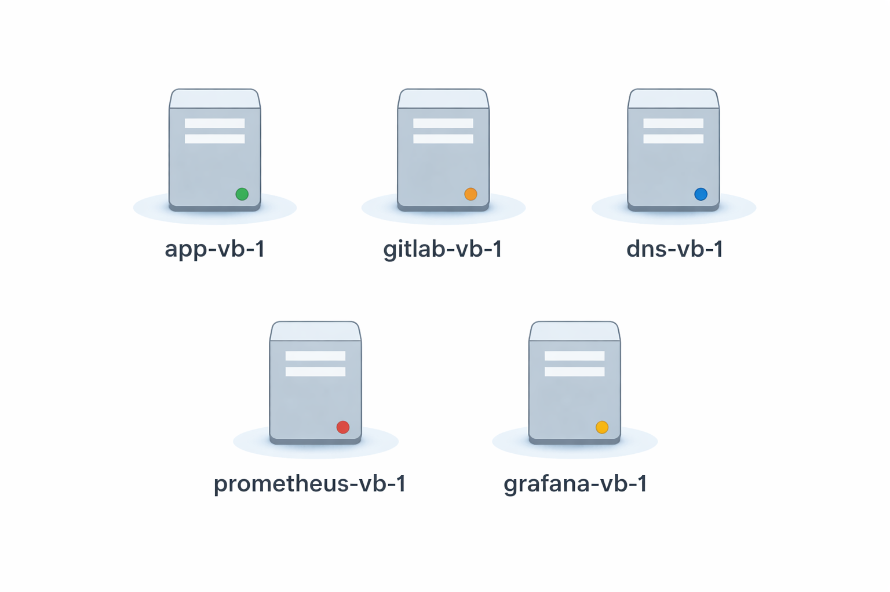

📷 Диаграмма архитектуры:

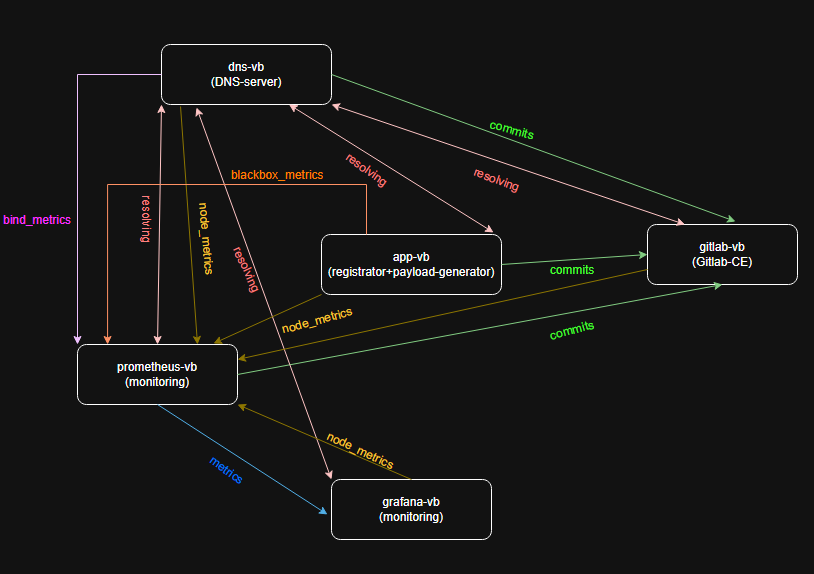

📂 Структура репозитория

my-devops/sre-project/

│

├── app/                     # Python приложение

│   ├── registrator/         # основное приложение и его Docker образ

│   └── payload_generator/   # генератор данных и его Docker образ

│    

│

├── dns/                     # конфигурация DNS (Bind)

│

├── monitoring/              # мониторинг и алертинг

│   ├── prometheus/          # конфигурация Prometheus

│   ├── grafana/             # dashboards и настройки Grafana

│   └── alerting/            # алерты и Telegram-бот

│

├── screenshots/             # скриншоты проекта (Grafana, алерты и т.д.)

│

└── README.md

⚙️ Технологии

· Python 3

· PostgreSQL

· GitLab CE

· Bind DNS

· Prometheus

· Grafana

· Node Exporter

· Blackbox Exporter

· Bind Exporter

· Docker / Docker Compose

🚀 Приложение

Python-приложение, состоящее из двух компонентов:

· registrator — регистрирует пользователей в PostgreSQL

· payload generator — генерирует случайные данные для нагрузки

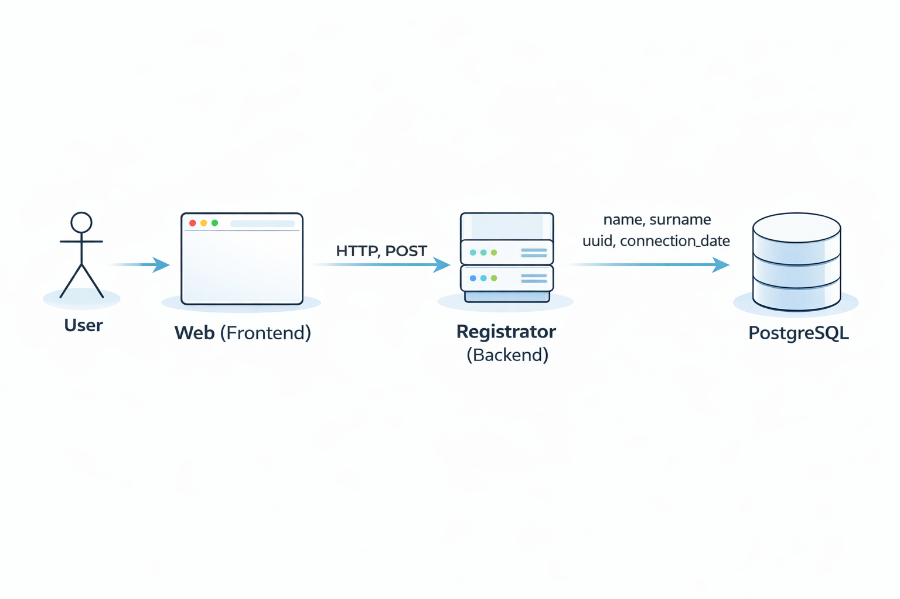

Приложение используется как тестовый сервис, за которым осуществляется наблюдение и сопровождение.

Запись ведётся в PostgreSQL

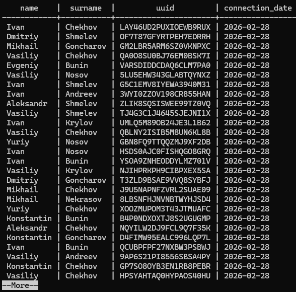

🌐 DNS сервер

Локальный DNS-сервер на базе Bind.

Используется для:

резолвинга имён сервисов внутри инфраструктуры

упрощения взаимодействия между виртуальными машинами

📂 GitLab

Развернут собственный GitLab Community Edition.

Используется для:

хранения кода

управления версиями

имитации production-like среды разработки

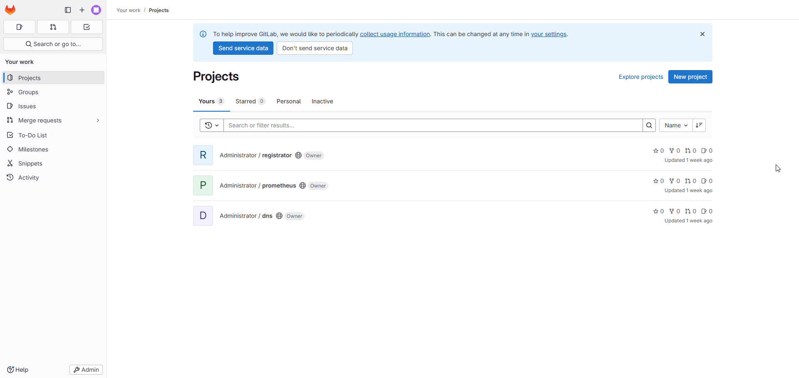

📊 Мониторинг - Prometheus

Реализовано:

· Сбор метрик со всех виртуальных машин (Node Exporter)

· Проверка доступности приложения (Blackbox Exporter)

· Мониторинг DNS (Bind Exporter)

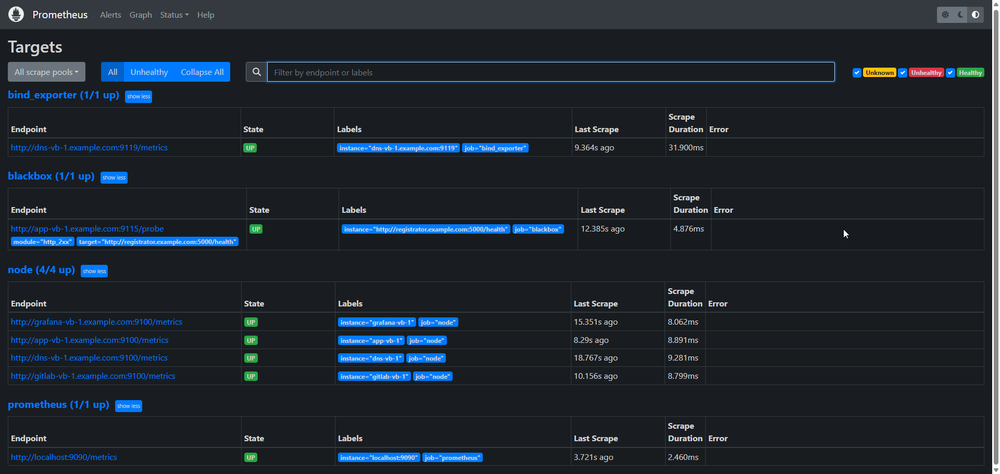

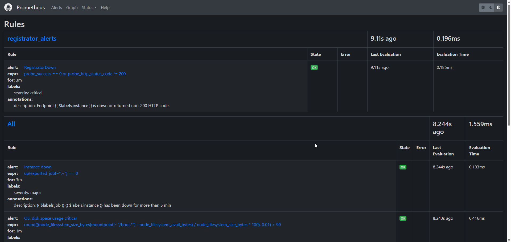

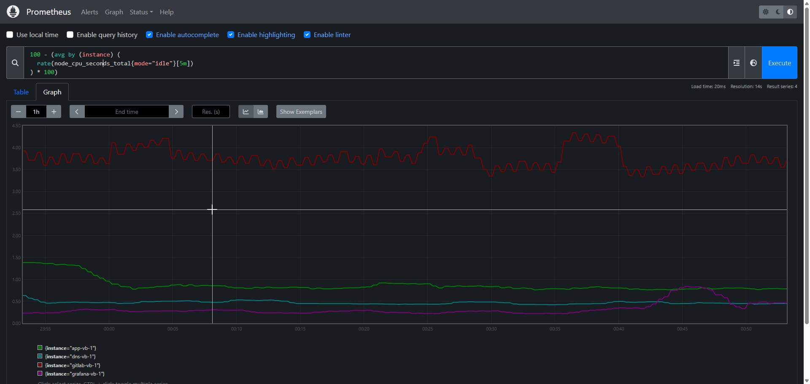

· Визуализация в Grafana

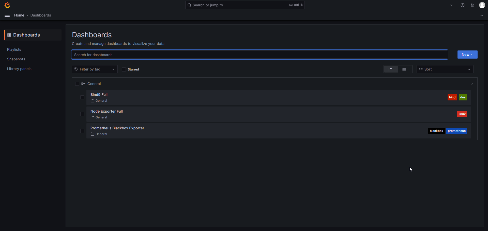

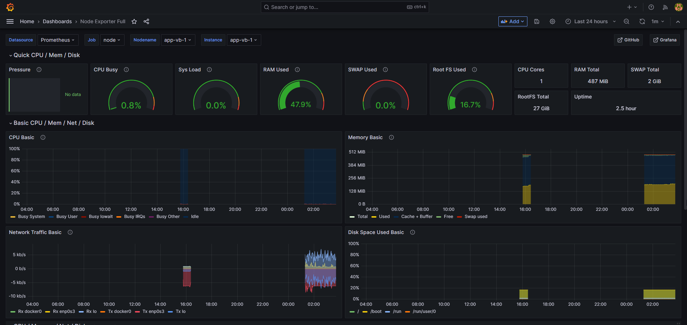

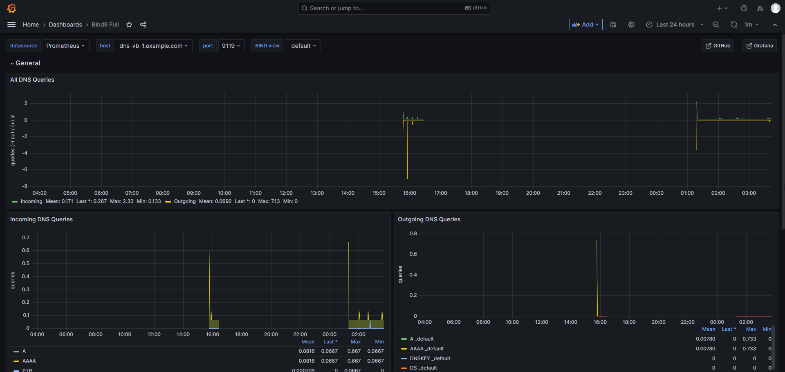

🚨 Алертинг

Алертинг через Telegram-бота

Срабатывает при:

· недоступности приложения

· проблемах с DNS

· высокой нагрузке 

    к примеру: - CPU usage > 80% (5 min)
               - Memory usage > 75%
               - Service down (Blackbox probe failed)
               - и так далее
               
.png)

.png)

🐳 Контейнеризация

Приложения registrator и payload generator контейнеризированы с использованием Docker.

Для каждого сервиса:

· создан отдельный Dockerfile

· собран Docker-образ

· контейнеры запускаются отдельно

Это позволяет:

· изолировать компоненты приложения

· упростить развёртывание

📦 Сборка образов

cd /app/registrator
docker build -t registrator .         # Сборка образа registrator

cd /app/payload_generator
docker build -t payload_generator .   # Сборка образа payload_generator

docker run -d --name registrator registrator              # Запуск контейнера с registrator

docker run -d --name payload-generator payload-generator  # Запуск контейнера с payload_generator

       # В текущей реализации используется ручной запуск контейнеров.
       # В дальнейшем планируется переход на docker-compose или Kubernetes.

🎯 Цели и итоги проекта

· Практика DevOps/SRE-навыков

· Настройка мониторинга и алертинга

· Работа с инфраструктурой из нескольких узлов

· Контейнеризация приложений

👤 Автор

Мохов Алексей (AlexMooo21)

junior DevOPS/SRE Engineer 

- GitHub: https://github.com/AlexMooo21
  
- Telegram: @ynazaf721

- Mail: z-aero@list.ru
